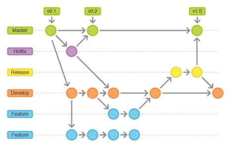

# **Guión sobre mi Github**

## **¿Que tenemos que hacer?**

### _1. Crear un Repositorio Público en GitHub:_

- Creamos un nuevo repositorio publico en GitHub dentro del vsCode.

### _2. Crear Ramas:_

- Una vez creado el repositorio, nos dirigimos a él y hacemos clic en la pestaña "Branches".

- Aquí, podemos crear las ramas necesarias para simular el flujo de trabajo. Creamos las siguientes ramas: main, develop, feature, y hotfix.

### _3. Como Cambiar De Ramas:_

- Para cambiar de ramas, para ayudarnos utilizamos gitlens donde en Branches, seleccionamos la rama que tenemos creada y le damos a Switch to Branch, y ya estariamos en la rama que queremos

### _4. Simular el Flujo de Trabajo:_

- En el main hacemos un commit cambiamos a hotfix y hacemos un merge con el main y hacemos un commit mas.

- Cambiamos a la rama develop y hacemos un commit.

- Hacemos un merge del hotfix con develop.

- Hacemos un commit.

- Cambiamos a feature y hacemos un commit.

- Del develop hacemos un merge con el feature.

- Cambiamos a realse, hacemos un commit y luego en el develop hacemos un merge con el realse.

- En el ultimo commit que hicimos del main ahora le hacemos a un merge con el release

- Dentro cambiamos a feature 2 y hacemos 4 commits.

### _4. Foto de como ha quedado la grafica:_

# Conclusion

- En conclusión, simular y gestionar conflictos de fusión en un repositorio de GitHub es una parte integral del proceso de desarrollo colaborativo. A través de un flujo de trabajo estructurado y el uso de herramientas como Git, podemos manejar eficazmente las diferentes ramas de desarrollo y fusionar cambios de manera ordenada. Al documentar y entender cada paso del proceso, podemos facilitar la colaboración entre equipos y mantener la integridad del código base. La resolución de conflictos no solo fortalece la comprensión del proyecto, sino que también fomenta la comunicación y el trabajo en equipo.

